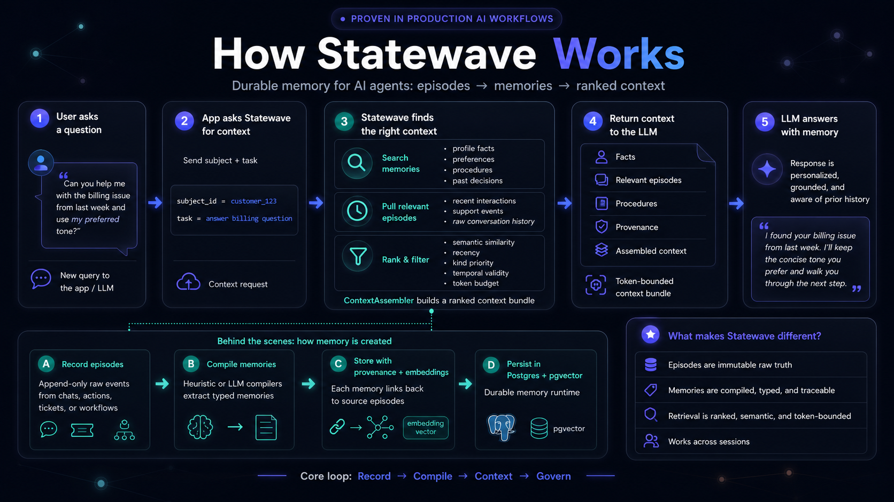
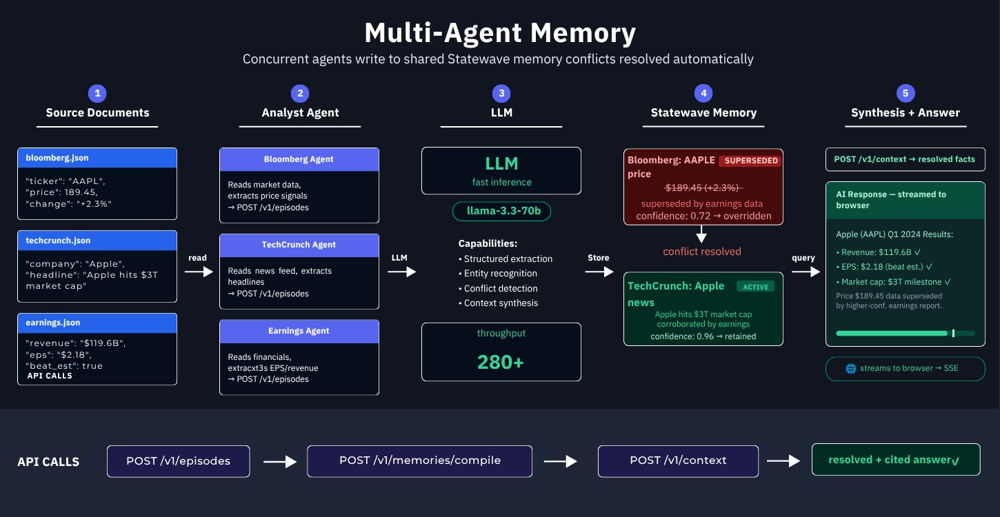
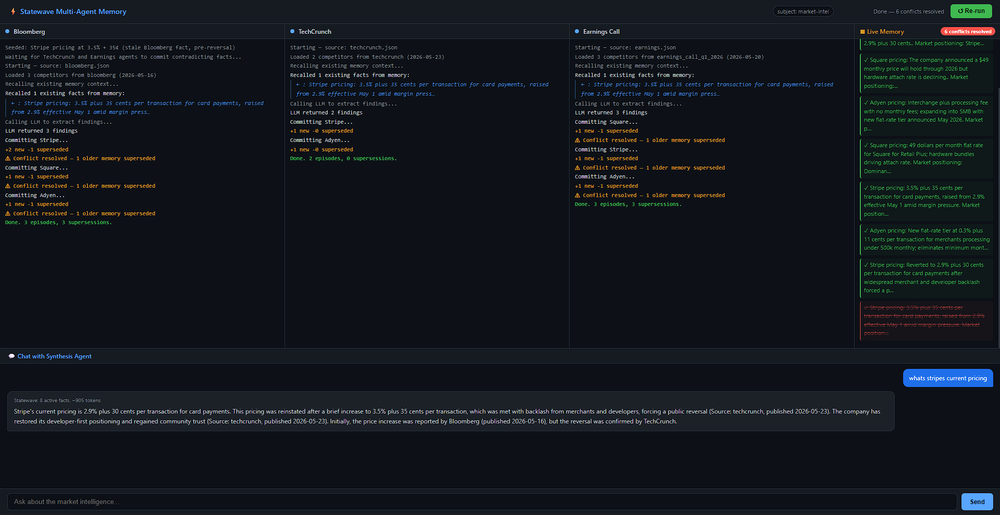

# Multi-Agent Memory with Statewave

[](https://www.python.org/downloads/)
[](LICENSE)
[](https://statewave.ai)

Three analyst agents ingest conflicting source documents concurrently. Watch Statewave detect the contradiction, supersede the stale fact, and serve the correct answer automatically, with no merge logic written by you.

---

## Contents

- [Multi-Agent Memory with Statewave](#multi-agent-memory-with-statewave)
  - [Contents](#contents)
  - [What is Statewave](#what-is-statewave)
  - [The problem this demo solves](#the-problem-this-demo-solves)
  - [What happens when you run it](#what-happens-when-you-run-it)
  - [How it works](#how-it-works)
    - [Key concepts](#key-concepts)
  - [Architecture](#architecture)
  - [Prerequisites](#prerequisites)
  - [Setup and run locally](#setup-and-run-locally)
    - [Option A: Docker Compose (recommended)](#option-a-docker-compose-recommended)
    - [Option B: run Python directly](#option-b-run-python-directly)
  - [Usage](#usage)
  - [Source documents](#source-documents)
  - [Environment variables](#environment-variables)
  - [Statewave API endpoints used](#statewave-api-endpoints-used)
  - [Audit inspector](#audit-inspector)
  - [Developer reference](#developer-reference)
    - [Project structure](#project-structure)
    - [SSE event types](#sse-event-types)
  - [License](#license)

---

## What is Statewave

Statewave is an open-source memory runtime for AI agents. You give it raw events (episodes); it compiles them into typed, conflict-resolved memories; your agents query it to get ranked, token-bounded context ready to drop into a prompt. No GPU. No vector database. No application-level merge logic.



The loop: **Ingest → Compile → Use**

Full documentation at [statewave.ai](https://statewave.ai).

---

## The problem this demo solves

In a typical multi-agent pipeline, two agents can read sources of different freshness and commit contradicting facts to the same shared store. The usual options are: blow up the context window by sending everything to the LLM and hoping it figures it out, or write custom merge logic that is brittle and hard to audit.

Statewave is the third option. When two memories about the same entity exceed a word-overlap similarity threshold, the compiler automatically supersedes the older one and records the decision with full provenance. Your agents query context and only ever see the winner.

---

## What happens when you run it

You click **Run pipeline**. Three agents: Bloomberg, TechCrunch, and Earnings, start concurrently. Each one reads its source document, extracts structured findings, and commits an episode to the shared Statewave subject `market-intel`. As each agent compiles, its memories appear live in the browser panel.

Then TechCrunch's compilation finishes. The Bloomberg Stripe entry goes red with a strikethrough. The status bar reads **"1 conflict resolved"**. You did not write any code to make that happen.

> **The moment that matters:** Bloomberg committed Stripe's old rate of 3.5% + 35¢. TechCrunch committed the post-reversal rate of 2.9% + 30¢. Statewave's compiler measured Jaccard word-overlap ≥ 0.6 between the two memories, marked Bloomberg as superseded by TechCrunch, and recorded the decision in the audit trail. When you ask _"What is Stripe's current processing fee?"_, the synthesis agent queries context and gets back 2.9%, it never sees the stale figure.

---

## How it works

Every agent follows the same three-step loop:

1. **Ingest.** The agent reads its source document, uses the LLM to extract structured findings, and calls `POST /v1/episodes` to append a raw, content-hashed episode to the shared subject. Episodes are append-only; nothing is overwritten.

2. **Compile.** The agent calls `POST /v1/memories/compile`. Statewave's heuristic compiler extracts typed memories from the episode log and runs conflict detection. If two memories about the same fact share enough word overlap (Jaccard ≥ 0.6), the older one is marked superseded with a provenance link to both source episodes.

3. **Use.** The synthesis agent calls `POST /v1/context` with the subject ID and the user's question. Statewave returns a ranked, token-bounded `assembled_context` containing only active (non-superseded) memories. The agent passes this bundle directly to the LLM and streams the answer back to the browser.

### Key concepts

| Concept                 | What it means                                                                                                                             |
| ----------------------- | ----------------------------------------------------------------------------------------------------------------------------------------- |
| **Episode**             | Append-only raw event: subject ID + source + type + payload. The immutable source of truth.                                               |
| **Memory**              | Extracted, typed, compiled summary. Traces back to source episodes with confidence scores and provenance.                                 |
| **Compile**             | Idempotent episodes → memories conversion. Heuristic (local) or LLM compiler. No GPU required.                                            |
| **Conflict resolution** | When two memories about the same fact exceed the similarity threshold, the older is automatically superseded by the newer. Deterministic. |
| **Context API**         | `POST /v1/context`: ranked, token-bounded context bundle ready for prompts. Same query, same bytes.                                       |
| **Subject**             | Any entity you track: user, agent, account, repo. Here: one subject (`market-intel`) per pipeline run.                                    |

---

## Architecture

Three concurrent agents share a single Statewave subject. The FastAPI server orchestrates the agents and pushes live updates to the browser via SSE. Statewave runs as a separate local service.

<picture>
  
</picture>

Demo interface during a full multi-agent run:



---

## Prerequisites

- **Docker** and **Docker Compose**: required for Option A (recommended)
- **LLM API key** from your Groq account (default) or any provider supported by LiteLLM (set `LLM_MODEL` accordingly)
- **Python 3.11+**: only needed for Option B (run without Docker)
- **Node.js 20+**: optional, for the audit inspector only

---

## Setup and run locally

### Option A: Docker Compose (recommended)

One command brings up the Statewave backend, its database, and the demo app together.

**1. Clone this repo**

```bash
git clone https://github.com/smaramwbc/statewave-multi-agent-memory
cd statewave-multi-agent-memory
```

**2. Configure environment**

```bash
cp .env.example .env
```

Open `.env` and set `LLM_API_KEY` to your LLM provider API key.

**3. Start everything**

```bash
docker compose up
```

Open [http://localhost:8000](http://localhost:8000) and click **Run pipeline**.

---

### Option B: run Python directly

Use this if you prefer to run the demo server outside Docker while still running Statewave via Docker.

**1. Clone this repo**

```bash
git clone https://github.com/smaramwbc/statewave-multi-agent-memory
cd statewave-multi-agent-memory
```

**2. Install Python dependencies**

```bash
pip install -r requirements.txt
```

**3. Configure environment**

```bash
cp .env.example .env
```

Open `.env` and set `LLM_API_KEY`. Set `STATEWAVE_URL` if your Statewave instance is not at the default `http://localhost:8100`.

**4. Start the Statewave backend**

```bash
docker compose up -d api db
```

**5. Start this demo**

```bash
python server.py
```

Open [http://localhost:8000](http://localhost:8000) and click **Run pipeline**.

---

## Usage

1. Click **Run pipeline**. Three agent panels appear and begin logging in real time.
2. Watch the Memory panel as each agent commits its findings. When TechCrunch's memory lands, the Bloomberg Stripe entry is immediately struck through in red.
3. The status bar updates to **"1 conflict resolved"** once compilation finishes.
4. Type a question in the chat input, e.g. _"What is Stripe's current processing fee?"_ and the synthesis agent answers using active memories only.
5. Click **Reset** to clear the subject and run again.

---

## Source documents

| File                      | Stripe fact                         | Role                                             |
| ------------------------- | ----------------------------------- | ------------------------------------------------ |
| `sources/bloomberg.json`  | 3.5% + 35¢ (stale, pre-reversal)    | Committed first; the fact to be superseded       |
| `sources/techcrunch.json` | 2.9% + 30¢ (correct, post-reversal) | Contradicts Bloomberg; triggers supersession     |
| `sources/earnings.json`   | 2.9% + 30¢ + Square miss            | Corroborates TechCrunch; contributes Square data |

The Bloomberg document intentionally contains a pre-reversal figure. The conflict is synthetic but structurally identical to what happens in real pipelines when agents pull from sources of different freshness.

---

## Environment variables

| Variable            | Required | Default                 | Description                                                                               |
| ------------------- | -------- | ----------------------- | ----------------------------------------------------------------------------------------- |
| `LLM_API_KEY`       | Yes      | —                       | API key for your LLM provider                                                             |
| `LLM_MODEL`         | No       | `groq/llama-3.3-70b-versatile` | LiteLLM model string — change to use a different provider (e.g. `openai/gpt-4o`) |
| `STATEWAVE_URL`     | No       | `http://localhost:8100` | Statewave server base URL                                                                 |
| `STATEWAVE_API_KEY` | No       | —                       | API key if your Statewave instance has auth enabled                                       |
| `APP_SECRET`        | No       | —                       | When set, all demo API endpoints require `X-API-Key: <value>`. Leave unset for local dev. |

---

## Statewave API endpoints used

| Endpoint                    | Purpose                                                |
| --------------------------- | ------------------------------------------------------ |
| `POST /v1/episodes`         | Ingest a raw episode from an agent                     |
| `POST /v1/memories/compile` | Trigger conflict detection and memory extraction       |
| `POST /v1/context`          | Retrieve ranked, token-bounded context for a query     |
| `GET /v1/timeline`          | Fetch full episode + memory timeline for the inspector |
| `DELETE /v1/subjects/{id}`  | Reset subject between pipeline runs                    |

---

## Audit inspector

The `inspector/` directory contains a TypeScript tool that prints the full audit trail for any subject: episodes in chronological order, derived memories, and supersession records with source references and Jaccard similarity scores.

```bash
cd inspector
npm install
npx tsx src/index.ts --subject-id market-intel
```

---

## Developer reference

### Project structure

```
statewave-multi-agent-memory/
├── agents/
│   ├── analyst.py          # Agent logic: ingest → compile → diff
│   └── base.py             # AsyncStatewaveClient wrapper
├── sources/
│   ├── bloomberg.json      # Stale Stripe pricing (3.5%) — to be superseded
│   ├── techcrunch.json     # Corrected Stripe pricing (2.9%) — supersedes Bloomberg
│   └── earnings.json       # Corroborates TechCrunch, adds Square data
├── inspector/
│   └── src/index.ts        # Audit trail: episodes, memories, supersessions
├── static/
│   └── index.html          # Browser UI (SSE-driven, zero build step)
├── server.py               # FastAPI app: /run /ask /events /memories
├── Dockerfile              # Builds the demo server as a container image
├── docker-compose.yml      # Starts db + Statewave API + demo in one command
├── requirements.txt
└── .env.example
```

### SSE event types

The browser receives a single `/events` stream. Event types:

| Event             | Payload             | Purpose                                       |
| ----------------- | ------------------- | --------------------------------------------- |
| `agent_log`       | `{ agent, msg }`    | Appends a log line to the named agent panel   |
| `memory_update`   | `{ agent, diff }`   | Applies a DOM diff to the Memory panel        |
| `agents_done`     | `{ supersessions }` | Enables chat input; updates status bar count  |
| `synthesis_token` | `{ token }`         | Streams one token into the active chat bubble |
| `synthesis_done`  | —                   | Finalizes the chat bubble                     |

---

## License

Apache-2.0. See [LICENSE](LICENSE).
