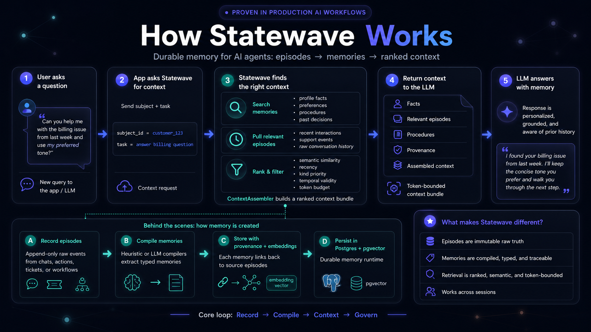
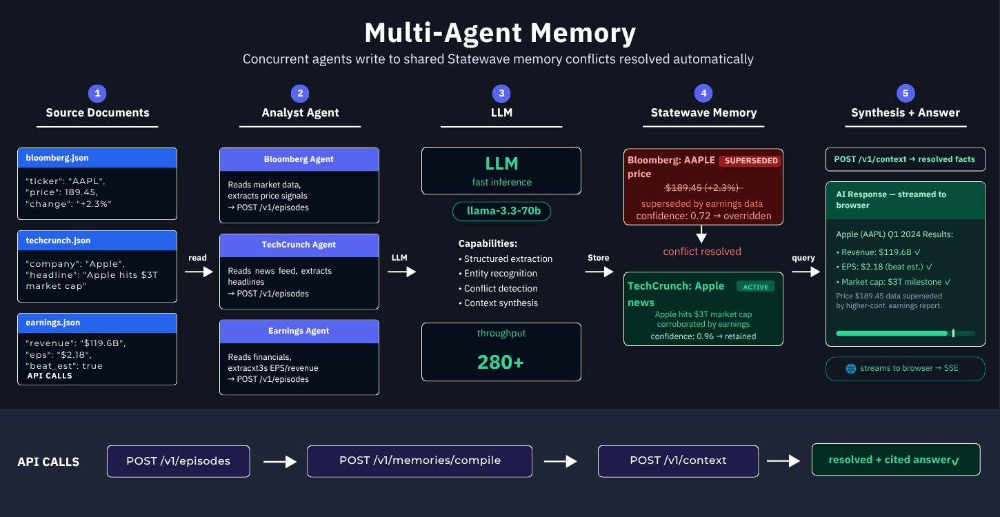
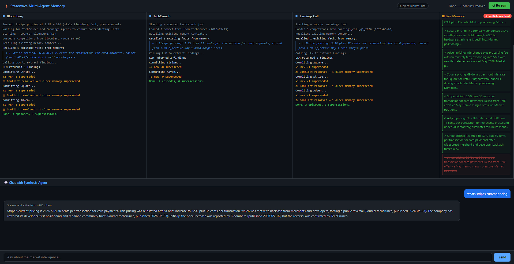

# Multi-Agent Memory with Statewave

[](https://www.python.org/downloads/)
[](LICENSE)
[](https://statewave.ai)

Three analyst agents ingest conflicting source documents concurrently. Watch Statewave detect the contradiction, supersede the stale fact, and serve the correct answer automatically, with no merge logic written by you.

> **Part of [Statewave](https://github.com/smaramwbc/statewave)** — the open-source memory runtime for AI agents.
>
> 📦 [Core runtime](https://github.com/smaramwbc/statewave) · 🐍 [Python SDK](https://github.com/smaramwbc/statewave-py) · 🟦 [TypeScript SDK](https://github.com/smaramwbc/statewave-ts) · 🔌 [Connectors](https://github.com/smaramwbc/statewave-connectors) · 📘 [Docs](https://github.com/smaramwbc/statewave-docs) · 💡 [Examples](https://github.com/smaramwbc/statewave-examples) · 🖥️ [Admin](https://github.com/smaramwbc/statewave-admin) · 🌐 [statewave.ai](https://statewave.ai)
>
> 📋 **Issues & feature requests:** [statewave/issues](https://github.com/smaramwbc/statewave/issues) (centralized tracker)

---

## Contents

- [Multi-Agent Memory with Statewave](#multi-agent-memory-with-statewave)
  - [Contents](#contents)
  - [What is Statewave](#what-is-statewave)
  - [The problem this demo solves](#the-problem-this-demo-solves)
  - [What happens when you run it](#what-happens-when-you-run-it)
  - [How it works](#how-it-works)
    - [Key concepts](#key-concepts)
  - [Architecture](#architecture)
  - [Prerequisites](#prerequisites)
  - [Setup and run locally](#setup-and-run-locally)
    - [Option A: npx (fastest)](#option-a-npx-fastest)
    - [Option B: Docker Compose](#option-b-docker-compose)
    - [Option C: run Python directly](#option-c-run-python-directly)
  - [Usage](#usage)
  - [Source documents](#source-documents)
  - [Environment variables](#environment-variables)
  - [Statewave API endpoints used](#statewave-api-endpoints-used)
  - [Audit inspector](#audit-inspector)
    - [Reading the audit trail](#reading-the-audit-trail)
  - [Adapting to your domain](#adapting-to-your-domain)
  - [Using Statewave with multi-agent frameworks](#using-statewave-with-multi-agent-frameworks)
  - [Developer reference](#developer-reference)
    - [Project structure](#project-structure)
    - [SSE event types](#sse-event-types)
  - [License](#license)

---

## What is Statewave

Statewave is an open-source memory runtime for AI agents. You give it raw events (episodes); it compiles them into typed, conflict-resolved memories; your agents query it to get ranked, token-bounded context ready to drop into a prompt. No GPU. No vector database. No application-level merge logic.



The loop: **Ingest → Compile → Use**

Full documentation at [statewave.ai](https://statewave.ai).

---

## The problem this demo solves

In a typical multi-agent pipeline, two agents can read sources of different freshness and commit contradicting facts to the same shared store. The usual options are: blow up the context window by sending everything to the LLM and hoping it figures it out, or write custom merge logic that is brittle and hard to audit.

Statewave is the third option. When two memories about the same entity exceed a word-overlap similarity threshold, the compiler automatically supersedes the older one and records the decision with full provenance. Your agents query context and only ever see the winner.

---

## What happens when you run it

You click **Run pipeline**. Three agents: Bloomberg, TechCrunch, and Earnings, start concurrently. Each one reads its source document, extracts structured findings, and commits an episode to the shared Statewave subject `market-intel`. As each agent compiles, its memories appear live in the browser panel.

Then TechCrunch's compilation finishes. The Bloomberg Stripe entry goes red with a strikethrough. The status bar reads **"1 conflict resolved"**. You did not write any code to make that happen.

> **The moment that matters:** Bloomberg committed Stripe's old rate of 3.5% + 35¢. TechCrunch committed the post-reversal rate of 2.9% + 30¢. Statewave's compiler measured Jaccard word-overlap ≥ 0.6 between the two memories, marked Bloomberg as superseded by TechCrunch, and recorded the decision in the audit trail. When you ask _"What is Stripe's current processing fee?"_, the synthesis agent queries context and gets back 2.9%, it never sees the stale figure.

---

## How it works

Every agent follows the same three-step loop:

1. **Ingest.** The agent reads its source document, uses the LLM to extract structured findings, and calls `POST /v1/episodes` to append a raw, content-hashed episode to the shared subject. Episodes are append-only; nothing is overwritten.

2. **Compile.** The agent calls `POST /v1/memories/compile`. Statewave's heuristic compiler extracts typed memories from the episode log and runs conflict detection. If two memories about the same fact share enough word overlap (Jaccard ≥ 0.6), the older one is marked superseded with a provenance link to both source episodes.

3. **Use.** The synthesis agent calls `POST /v1/context` with the subject ID and the user's question. Statewave returns a ranked, token-bounded `assembled_context` containing only active (non-superseded) memories. The agent passes this bundle directly to the LLM and streams the answer back to the browser.

### Key concepts

| Concept                 | What it means                                                                                                                             |
| ----------------------- | ----------------------------------------------------------------------------------------------------------------------------------------- |
| **Episode**             | Append-only raw event: subject ID + source + type + payload. The immutable source of truth.                                               |
| **Memory**              | Extracted, typed, compiled summary. Traces back to source episodes with confidence scores and provenance.                                 |
| **Compile**             | Idempotent episodes → memories conversion. Heuristic (local) or LLM compiler. No GPU required.                                            |
| **Conflict resolution** | When two memories about the same fact exceed the similarity threshold, the older is automatically superseded by the newer. Deterministic. |
| **Context API**         | `POST /v1/context`: ranked, token-bounded context bundle ready for prompts. Same query, same bytes.                                       |
| **Subject**             | Any entity you track: user, agent, account, repo. Here: one subject (`market-intel`) per pipeline run.                                    |

---

## Architecture

Three concurrent agents share a single Statewave subject. The FastAPI server orchestrates the agents and pushes live updates to the browser via SSE. Statewave runs as a separate local service.

<picture>
  
</picture>

Demo interface during a full multi-agent run:



---

## Prerequisites

- **Node.js 20+**: required for Option A (fastest; boots Statewave via `npx`) and for the audit inspector
- **Python 3.11+**: required to run this demo app in all options
- **LLM API key** from your Groq account (default) or any provider supported by LiteLLM (set `LLM_MODEL` accordingly)
- **Docker** and **Docker Compose**: only needed for Option B

---

## Setup and run locally

### Option A: npx (fastest)

Statewave ships a one-line launcher: no Docker, no account, runs offline. It boots the API, admin console, and Postgres, and wires itself into your MCP clients.

**1. Clone this repo**

```bash
git clone https://github.com/smaramwbc/statewave-multi-agent-memory
cd statewave-multi-agent-memory
```

**2. Start Statewave**

```bash
npx @statewavedev/statewave
```

This starts the Statewave backend at `http://localhost:8100` (leave this running in its own terminal). macOS/Linux/Windows all work; you can also use the install script instead of `npx`:

```bash
curl -fsSL https://www.statewave.ai/install | sh   # macOS/Linux
irm https://www.statewave.ai/install.ps1 | iex       # Windows PowerShell
```

**3. Install Python dependencies and configure environment**

```bash
pip install -r requirements.txt
cp .env.example .env
```

Open `.env` and set `LLM_API_KEY` to your LLM provider API key.

**4. Start this demo**

```bash
python server.py
```

Open [http://localhost:8000](http://localhost:8000) and click **Run pipeline**.

---

### Option B: Docker Compose

Use this if you want Statewave running alongside the demo in containers (e.g. for a production-like Postgres setup), rather than the lightweight `npx` launcher.

**1. Clone this repo**

```bash
git clone https://github.com/smaramwbc/statewave-multi-agent-memory
cd statewave-multi-agent-memory
```

**2. Configure environment**

```bash
cp .env.example .env
```

Open `.env` and set `LLM_API_KEY` to your LLM provider API key.

**3. Start everything**

```bash
docker compose up
```

Open [http://localhost:8000](http://localhost:8000) and click **Run pipeline**.

---

### Option C: run Python directly

Use this if you prefer to run the demo server outside Docker while still running Statewave via Docker.

**1. Clone this repo**

```bash
git clone https://github.com/smaramwbc/statewave-multi-agent-memory
cd statewave-multi-agent-memory
```

**2. Install Python dependencies**

```bash
pip install -r requirements.txt
```

**3. Configure environment**

```bash
cp .env.example .env
```

Open `.env` and set `LLM_API_KEY`. Set `STATEWAVE_URL` if your Statewave instance is not at the default `http://localhost:8100`.

**4. Start the Statewave backend**

```bash
docker compose up -d api db
```

**5. Start this demo**

```bash
python server.py
```

Open [http://localhost:8000](http://localhost:8000) and click **Run pipeline**.

---

## Usage

1. Click **Run pipeline**. Three agent panels appear and begin logging in real time.
2. Watch the Memory panel as each agent commits its findings. When TechCrunch's memory lands, the Bloomberg Stripe entry is immediately struck through in red.
3. The status bar updates to **"1 conflict resolved"** once compilation finishes.
4. Type a question in the chat input, e.g. _"What is Stripe's current processing fee?"_ and the synthesis agent answers using active memories only.
5. Click **Reset** to clear the subject and run again.

---

## Source documents

| File                      | Stripe fact                         | Role                                             |
| ------------------------- | ----------------------------------- | ------------------------------------------------ |
| `sources/bloomberg.json`  | 3.5% + 35¢ (stale, pre-reversal)    | Committed first; the fact to be superseded       |
| `sources/techcrunch.json` | 2.9% + 30¢ (correct, post-reversal) | Contradicts Bloomberg; triggers supersession     |
| `sources/earnings.json`   | 2.9% + 30¢ + Square miss            | Corroborates TechCrunch; contributes Square data |

The Bloomberg document intentionally contains a pre-reversal figure. The conflict is synthetic but structurally identical to what happens in real pipelines when agents pull from sources of different freshness.

---

## Environment variables

| Variable                    | Required | Default                        | Description                                                                                       |
| --------------------------- | -------- | ------------------------------ | ------------------------------------------------------------------------------------------------- |
| `LLM_API_KEY`               | Yes      | (none)                         | API key for your LLM provider                                                                     |
| `LLM_MODEL`                 | No       | `groq/llama-3.3-70b-versatile` | LiteLLM model string. Change to use a different provider, e.g. `openai/gpt-4o`                   |
| `STATEWAVE_URL`             | No       | `http://localhost:8100`        | Statewave server base URL                                                                         |
| `STATEWAVE_API_KEY`         | No       | (none)                         | API key if your Statewave instance has auth enabled                                               |
| `APP_SECRET`                | No       | (none)                         | When set, all demo API endpoints require `X-API-Key: <value>`. Leave unset for local dev.        |
| `SUBJECT_ID`                | No       | `market-intel`                 | Shared Statewave memory namespace. Change when adapting to a different domain.                    |
| `SYNTHESIS_SYSTEM_PROMPT`   | No       | (built-in analyst prompt)      | System instruction given to the LLM when answering questions. Override to match your domain.      |
| `DEMO_SEED_BLOOMBERG_STRIPE`| No       | `true`                         | Pre-seeds the stale Bloomberg Stripe fact. Set to `false` when using your own source files.       |

---

## Statewave API endpoints used

| Endpoint                    | Purpose                                                |
| --------------------------- | ------------------------------------------------------ |
| `POST /v1/episodes`         | Ingest a raw episode from an agent                     |
| `POST /v1/memories/compile` | Trigger conflict detection and memory extraction       |
| `POST /v1/context`          | Retrieve ranked, token-bounded context for a query     |
| `GET /v1/timeline`          | Fetch full episode + memory timeline for the inspector |
| `DELETE /v1/subjects/{id}`  | Reset subject between pipeline runs                    |

---

## Audit inspector

The `inspector/` directory contains a TypeScript tool that prints the full audit trail for any subject: episodes in chronological order, derived memories, and supersession records with source references and Jaccard similarity scores.

```bash
cd inspector
npm install
npx tsx src/index.ts --subject-id market-intel
```

### Reading the audit trail

The inspector output has three sections:

**Episodes**: raw, append-only inputs from each agent. Each episode shows the source, type, and the payload text that was ingested.

**Memories**: the compiled, typed facts extracted from episodes. Each memory shows:
- `status: active`: currently the authoritative version of this fact
- `status: superseded`: an older version that was replaced; still in the audit trail for provenance
- `superseded_by`: the ID of the memory that replaced it

**Supersessions**: the conflict resolution decisions. Each entry shows:
- Which memory was replaced and by which
- The Jaccard word-overlap similarity score that triggered the supersession (threshold: ≥ 0.6)
- The source episodes on both sides

Example output after the demo run:

```
EPISODES (5 total)
  bloomberg/2026-05-16  agent.analyst.findings  Stripe pricing (bloomberg, 2026-05-16): 3.5% + 35¢...
  techcrunch/2026-06-01 agent.analyst.findings  Stripe pricing (techcrunch, 2026-06-01): 2.9% + 30¢...
  earnings/2026-06-15   agent.analyst.findings  Stripe pricing (earnings, 2026-06-15): 2.9% + 30¢...
  bloomberg/2026-05-16  agent.analyst.findings  Square positioning (bloomberg): leading mobile POS...
  earnings/2026-06-15   agent.analyst.findings  Square revenue miss Q2 2026...

MEMORIES (4 active, 1 superseded)
  [active]     techcrunch  Stripe pricing (techcrunch, 2026-06-01): 2.9% + 30¢...
  [superseded] bloomberg   Stripe pricing (bloomberg, 2026-05-16): 3.5% + 35¢...
                             superseded_by → techcrunch memory (Jaccard: 0.72)
  [active]     bloomberg   Square positioning (bloomberg): leading mobile POS...
  [active]     earnings    Square: missed Q2 revenue estimates by 8%...
  [active]     bloomberg   Square key differentiators: offline mode, hardware...

SUPERSESSIONS (1)
  bloomberg Stripe pricing → superseded by techcrunch Stripe pricing
  similarity: 0.72  (threshold: 0.60)
  older episode: bloomberg/2026-05-16
  newer episode: techcrunch/2026-06-01
```

The key insight: Bloomberg's independent Square facts (`positioning`, `differentiators`) survived the Stripe supersession because they are separate atomic memories with no word overlap against the Stripe memories. Only the stale pricing fact was replaced.

---

## Adapting to your domain

The demo is wired for competitive intelligence on payment processors. To run it for a different domain, you only need to change `.env` and drop in new JSON source files. No Python changes required.

**1. Set your subject ID and prompts in `.env`**

```bash
# The shared memory namespace for this pipeline run
SUBJECT_ID=healthcare-news

# The instruction given to the LLM when answering questions in the chat panel
SYNTHESIS_SYSTEM_PROMPT=You are a healthcare policy analyst. Answer using ONLY the provided memory context. Do not invent facts. Be concise: 3-5 sentences.

# Disable the payment-processor seed (only relevant for the default demo sources)
DEMO_SEED_BLOOMBERG_STRIPE=false
```

**2. Add your source files to `sources/`**

Each JSON file becomes one agent. The agent ID is the filename stem (e.g. `reuters.json` → agent `reuters`). Source files follow this schema:

```json
{
  "source": "reuters",
  "published": "2024-11-01",
  "headline": "Optional headline for context",
  "competitors": [
    {
      "name": "Entity Name",
      "pricing_model": "Relevant factual claim about pricing or cost",
      "market_positioning": "How this entity positions itself",
      "key_differentiators": ["differentiator one", "differentiator two"],
      "confidence_notes": "Source and date of this data"
    }
  ]
}
```

The field names (`pricing_model`, `market_positioning`, `key_differentiators`) are generic; they map to "primary fact", "positioning fact", and "list of facts" in Statewave. Name them whatever fits your domain. Only `name` is required.

**3. Run**

```bash
python server.py
```

All JSON files in `sources/` are discovered automatically. The pipeline runs one agent per file. Conflict detection works the same way regardless of domain.

---

## Developer reference

### Project structure

```
statewave-multi-agent-memory/
├── agents/
│   ├── analyst.py          # Agent logic: ingest, compile, diff
│   ├── base.py             # AsyncStatewaveClient wrapper
│   └── candidates.py       # Deterministic structured memory candidate builder
├── sources/
│   ├── bloomberg.json      # Stale Stripe pricing (3.5%) to be superseded
│   ├── techcrunch.json     # Corrected Stripe pricing (2.9%) supersedes Bloomberg
│   └── earnings.json       # Corroborates TechCrunch, adds Square data
├── tests/
│   ├── test_candidates.py  # Unit tests for build_competitor_candidates
│   └── test_memory_diff.py # Unit tests for the memory diff logic
├── inspector/
│   └── src/index.ts        # Audit trail: episodes, memories, supersessions
├── static/
│   └── index.html          # Browser UI (SSE-driven, zero build step)
├── server.py               # FastAPI app: /run /ask /events /memories
├── statewave_tools.py      # Drop-in helpers: remember(), compile(), recall()
├── Dockerfile              # Builds the demo server as a container image
├── docker-compose.yml      # Starts db + Statewave API + demo in one command
├── requirements.txt
└── .env.example
```

### SSE event types

The browser receives a single `/events` stream. Event types:

| Event             | Payload             | Purpose                                       |
| ----------------- | ------------------- | --------------------------------------------- |
| `agent_log`       | `{ agent, msg }`    | Appends a log line to the named agent panel   |
| `memory_update`   | `{ agent, diff }`   | Applies a DOM diff to the Memory panel        |
| `agents_done`     | `{ supersessions }` | Enables chat input; updates status bar count  |
| `synthesis_token` | `{ token }`         | Streams one token into the active chat bubble |
| `synthesis_done`  | (none)              | Finalizes the chat bubble                     |

---

## Using Statewave with multi-agent frameworks

Most developers building multi-agent systems reach for a framework like CrewAI, LangGraph, or the Claude SDK rather than writing raw orchestration. Statewave slots in as the **shared memory layer** for any of them. The three API calls (`/v1/episodes`, `/v1/memories/compile`, `/v1/context`) are framework-agnostic; you wrap them in a tool, a node, or a hook.

### The pattern (framework-independent)

Copy [`statewave_tools.py`](statewave_tools.py) from this repo into your project. It wraps the official Statewave SDK in three simple functions (`pip install statewave`):

```python
from statewave_tools import configure, remember, compile, recall

configure("http://localhost:8100")   # point at your Statewave instance

# 1. Ingest: write what your agent found
remember("my-subject", "agent-a", "Stripe charges 2.9% + 30¢ per transaction.")

# 2. Compile: detect conflicts and supersede stale facts
compile("my-subject")

# 3. Use: get ranked, conflict-resolved context for the next prompt
context = recall("my-subject", "What does Stripe charge?")
# → drop context directly into your LLM system prompt or user message
```

These three functions are all you need regardless of which framework you use.

### CrewAI

```python
from crewai.tools import tool
from statewave_tools import configure, remember, compile, recall

configure("http://localhost:8100")

@tool("Remember a finding")
def remember_finding(subject_id: str, source: str, text: str) -> str:
    """Commit a finding to shared memory and compile it."""
    remember(subject_id, source, text)
    compile(subject_id)
    return "committed"

@tool("Recall context")
def recall_context(subject_id: str, question: str) -> str:
    """Retrieve conflict-resolved memory context for a question."""
    return recall(subject_id, question)
```

Assign both tools to whichever agents need shared memory. Statewave handles conflict resolution when two agents write contradicting facts; you write no merge logic in the crew.

### LangGraph

```python
from langgraph.graph import StateGraph, MessagesState
from statewave_tools import configure, remember, compile, recall

configure("http://localhost:8100")
SUBJECT = "research-subject"

def ingest_node(state: MessagesState):
    finding = state["messages"][-1].content
    remember(SUBJECT, "researcher", finding)
    compile(SUBJECT)
    return state

def recall_node(state: MessagesState):
    question = state["messages"][-1].content
    context = recall(SUBJECT, question)
    return {"messages": [{"role": "system", "content": context}] + state["messages"]}

graph = StateGraph(MessagesState)
graph.add_node("ingest", ingest_node)
graph.add_node("recall", recall_node)
```

### Claude (Anthropic SDK / tool use)

```python
import anthropic
from statewave_tools import configure, remember, compile, recall

configure("http://localhost:8100")
client = anthropic.Anthropic()

tools = [
    {
        "name": "remember",
        "description": "Commit a finding to shared memory.",
        "input_schema": {
            "type": "object",
            "properties": {
                "subject_id": {"type": "string"},
                "text": {"type": "string"}
            },
            "required": ["subject_id", "text"]
        }
    },
    {
        "name": "recall",
        "description": "Retrieve conflict-resolved context for a question.",
        "input_schema": {
            "type": "object",
            "properties": {
                "subject_id": {"type": "string"},
                "question": {"type": "string"}
            },
            "required": ["subject_id", "question"]
        }
    }
]

def handle_tool(name, inputs):
    if name == "remember":
        remember(inputs["subject_id"], "claude-agent", inputs["text"])
        compile(inputs["subject_id"])
        return "committed"
    if name == "recall":
        return recall(inputs["subject_id"], inputs["question"])
```

Multiple Claude agents sharing the same `subject_id` automatically get conflict-resolved memory. This is the same mechanism the demo uses, exposed as native tool calls.

### What you never have to write

Whichever framework you use, Statewave removes the same set of problems:

- **Conflict detection**: no custom similarity checks or "latest wins" rules
- **Supersession with provenance**: full audit trail of which episode beat which, and why
- **Token management**: `max_tokens` on `/v1/context` returns a ranked bundle that fits your prompt budget
- **Concurrent write safety**: episodes are append-only; compile is idempotent

---

## License

Apache-2.0. See [LICENSE](LICENSE).
